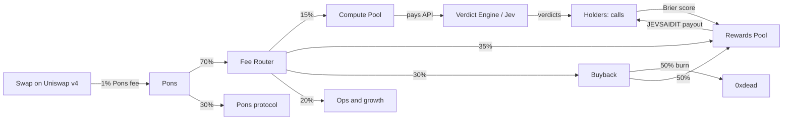

# Jev Said It — project draft v0.3

Date: 20 September 2026 · Status: draft v0.3, decisions taken: Robinhood Chain, Pons v2, own Fee Router, name **Jev Said It / $JEVSAIDIT** (renamed on 20/09, see §9). No implementation started (as of 20/09: the contracts and the engine have since been built, see `contracts/` and `engine/`)
Not affiliated with TypeSafe AI. "Jev" is TypeSafe's model; this project uses it as a component.

## 1. Thesis in one sentence

A product on Robinhood Chain in which Jev issues "typed verdicts" every hour on real on-chain events (new Pons launches, price thresholds, whale movements), $JEVSAIDIT holders stake their reputation (not money) on agreeing or disagreeing with Jev, and the token's trading fees pay for the model, the rewards for the best forecasters and the buybacks. The more the product is used, the more the token is traded; the more the token is traded, the more intelligence the product can buy.

## 2. Lessons from the Jev tokens already launched (research of 20/09)

| Observation | Consequence for the design |
|---|---|
| OpenJEV generated ~$50K in creator fees in under 24h with a product that worked at launch (API relay + treasury dashboard) | The product must be live at minute zero; on-chain fee transparency is the real marketing |
| JevPad (-91% in 10h) and Jev Labs (-82% in 8h) had interesting mechanics but only landing pages and "agents indexing" | No promises: the first verdict epoch starts within 10 minutes of launch |
| Jev/NVDAx on Solana with a 3% transfer fee: flat volume | Zero transfer taxes. Fees are taken only at the swap level (Pons 1%) |
| Black Box: site that denies the token, "community takeover", first wallet at 26.6% | Name and ticker distinct from "JEV" (dozens of clones), public team wallets, initial per-wallet cap |
| Jev 1.13 is already on OpenRouter at $0.042/M input tokens, output free | Reselling API access is not a moat. The moat is the product and the data it accumulates |
| Pons v2: 1% fee on every swap, 70% to the creator, Uniswap v4 pool locked forever | With $1M/day of volume the treasury collects ~$7,000/day without touching the supply |
| The Jev cost is negligible: ~$0.00008 per call | The "compute" share of fees can stay low (15%); most of it goes to rewards and buybacks |

## 3. Three proposals

### A. Jev Said It (verdict markets) (recommended)
Micro-markets of judgment, not of money. Each epoch (6h) the engine generates 10-20 typed questions on verifiable on-chain facts ("will token X hold +20% within 1h?", "is this Pons launch a rug?"). Jev answers with a calibrated probability. Holders make free "calls" (agree/disagree), in a number proportional to their balance. Resolution is on-chain (price at T+1h, outcome of the launch). The best forecasters of the epoch are paid in $JEVSAIDIT from the Rewards Pool funded by fees.
- Pro: a new product in the lore (nobody does it), a clear fees → intelligence → users loop, viral content every 6 hours (leaderboards, "Jev was right 71% of the time"), no betting pool between users (simpler legal profile)
- Con: needs a reliable off-chain engine and a resolution oracle; 3 weeks of build with 3 people

### B. Jev Compute Treasury (dev-first)
A "serious" version of OpenJEV: SDK, MCP server and Jev credits for developers paid by fees, with rate-limit tiers tied to balance. Volume incentivized with fee rebates in credits.
- Pro: simpler build, a real developer audience
- Con: OpenJEV and JevForAll already occupy the space; Jev on OpenRouter makes the relay hard to defend; volume depends on AI hype, not on recurring use

### C. Jev Arena on Solana (meme-first)
Black Box done right: each epoch Jev picks the reward token distributed to holders (Reflex), with a public log of decisions and no dominant wallet.
- Pro: higher meme velocity, launch in 3 days via pump.fun + Reflex
- Con: typical lifespan of days, more volatile creator fees, high risk of being seen as a copy

Recommendation: A, incorporating B's "compute pool" as an internal component and keeping C as a possible cross-chain expansion once the engine exists.

## 4. Architecture of proposal A

### 4.1 Components
1. **$JEVSAIDIT token** — ERC-20 on Robinhood Chain (chain id 4663), supply 1 billion, zero taxes, launched 100% on the Pons v2 bonding curve, which graduates into a locked Uniswap v4 pool. The team buys on the curve like everyone else: **25% declared, no vesting** (decision of 20/09). Pons has no reserved allocation, so it is a purchase with the team's ETH in the first seconds, subject to the snipe tax. Team wallets published before launch and labeled in the dashboard; excluded from rewards and rebates.
2. **Fee Router** (contract, ~150 lines, to be audited) — receives 70% of the Pons fee (0.7% of volume) and splits it automatically every epoch: 15% Compute Pool, 35% Rewards Pool, 30% Buyback, 20% Ops. Every split is an on-chain event readable by the dashboard.
3. **Verdict Engine** (off-chain service, open source) — reads on-chain state (new Pons pools, Dexscreener prices, whale transfers), formulates typed questions, calls Jev (directly or via OpenRouter as a fallback), publishes verdict + probability with a signature, then resolves with on-chain data at expiry. Abstraction over the model: if Jev becomes inaccessible, the engine runs on another decision model without stopping the product.
4. **Call Ledger** (contract) — records holders' calls (agree/disagree, epoch, balance snapshot). Capacity: 1 call per 10,000 $JEVSAIDIT in the wallet, capped at 50 calls per epoch per wallet. Snapshot at the start of the epoch to prevent flash-buys.
5. **Rewards Pool** — pays in $JEVSAIDIT the top 10% of forecasters of each epoch based on a Brier score (rewards calibration, not the number of calls). Weekly claim.
6. **Verdict Terminal** (frontend) — live verdict feed, Jev scan of every new Pons launch with an ape/watch/avoid label, 1-click swap via Uniswap v4 with a 0.25% interface fee (extra revenue not tied to our token), leaderboard, treasury dashboard.
7. **Agent API + MCP server** — third-party agents (JevBook bots, Claude/Cursor agents) read the verdicts and can make calls on behalf of wallets that authorize them. Activity 24/7, even when humans are asleep.

### 4.2 Fee flow

### 4.3 Volume mechanics, in order of legitimacy
1. **Call capacity tied to balance** — whoever wants to play must hold tokens; whoever wants to play more must buy more. Organic demand, no payment for volume.
2. **Rewards paid in $JEVSAIDIT** — winners partly sell, partly accumulate: both are real volume.
3. **Scheduled buyback from the Fee Router** — every epoch 30% of fees buys $JEVSAIDIT on-chain (random block within the window to avoid front-running). Half burned, half to the Rewards Pool. Visible volume and structural support.
4. **Conditional fee rebate (approved)** — whoever made at least 1 call in the epoch gets back 25% of the fees paid on their own swaps, in $JEVSAIDIT. With a 1% fee and a 0.25% rebate, wash trading always stays at a loss. The rebate is worth 0.25% of the trader's volume while the treasury collects 0.7% of it: in the extreme case it absorbs about 36% of revenue, so it is paid from the rewards bucket with a sub-cap at 60% of the epoch budget and pro-rata scaling.
5. **Verdict Terminal as the entry point** — Robinhood Chain traders come for the Jev scan on new launches (a real need: the chain burns 80% of tokens in 24h), and stay for the game. The 0.25% interface fee also monetizes traffic that does not touch $JEVSAIDIT.
6. **Stock-paired secondary pools with a Uniswap v4 hook (phase 2)** — JEVSAIDIT/NVDAx and JEVSAIDIT/OPENAIx1L follow the chain's trend, attract arbitrage, and the proprietary hook brings a dynamic fee straight into the treasury.
7. **Weekly Verdict Cup** — prize pool from the Rewards Pool, external sponsors, native content for X.

What NOT to do: pay for raw volume, airdrops by number of transactions, transfer taxes, "surprise buybacks" announced on X.

### 4.4 Dependence on Jev and fallback
- Access: TypeSafe early access or OpenRouter (Jev 1.13, 32K context, $0.042/M input, output free). The Compute Pool pays in stablecoin/fiat through an ops wallet.
- Cost: 100,000 calls/day × ~$0.00008 = about $8/day. The 15% of fees is oversized on purpose and also funds RPC, indexer and hosting.
- TypeSafe's public Terms of Use do not mention resale, wrappers or crypto; the specific API terms are not public. We consume Jev for our own product, we do not resell it: it is the most defensible position. Model abstraction in the engine as insurance.

## 5. Fee economics (creator fee 0.7% of volume)

| Daily volume | Treasury fees/day | Compute 15% | Rewards 35% | Buyback 30% | Ops 20% |
|---|---|---|---|---|---|
| $200K | $1,400 | $210 | $490 | $420 | $280 |
| $1M | $7,000 | $1,050 | $2,450 | $2,100 | $1,400 |
| $3M | $21,000 | $3,150 | $7,350 | $6,300 | $4,200 |

Reference: OpenJEV did $2.9M of volume in its first 18 hours. The exact fee percentages on Pons v2 are set per launch and readable on-chain: to be verified before deploy.

## 6. Launch plan

| Phase | What | Exit |
|---|---|---|
| Weeks 1-2 | Build: Fee Router + Call Ledger (Solidity), Verdict Engine (TypeScript), Terminal, dashboard. Deploy on Robinhood testnet (46630). Light audit of the two contracts | Internal demo with 3 real epochs on testnet |
| Week 3 | Open-source repo, site, X, Telegram. Public dry-run on testnet with leaderboard and symbolic rewards. Contact JevBook for feed integration | 300+ wallets in the dry-run |
| T0 | Launch on Pons v2 with the engine already live: first verdict within 10 minutes. Dexscreener profile claimed immediately (site, X, docs). Team wallets published before launch. A single Dexscreener boost | Product + token in the same minute |
| T+7 | Verdict Cup #1, first weekly treasury report | D7 retention measured |
| T+14 | Stock-paired pools with v4 hook | Second fee source |
| T+30 | Public Agent API + MCP, integration bounties | Non-human activity > 30% of calls |

Minimum team: 1 Solidity, 1 backend/data, 1 frontend, 3 weeks. Live budget: light audit, RPC/indexer, 0.0005 ETH Pons launch fee, initial liquidity bought on the curve.

## 7. KPIs to watch

- Treasury fees per day and % actually executed as buyback
- Calls per epoch, unique wallets making calls, D7 retention
- Jev accuracy vs baseline (must be published even when it looks bad)
- Total holders, top-10 concentration excluding the pool below 35%
- Buy/sell ratio and share of volume coming from the Terminal
- Share of calls made by agents via API

## 8. Risks and mitigations

| Risk | Mitigation |
|---|---|
| TypeSafe limits access or changes its terms | Model abstraction, dual channel (direct + OpenRouter), no resale |
| The game is read as betting or a derivative | No pool between users, free calls, rewards from fees: it is a skill contest. A legal opinion per jurisdiction is still needed, with geoblocking where necessary |
| Wash trading for the rebate | Rebate 25% < fee 100%, balance snapshot, per-wallet cap |
| Confusion with "JEV" clones and impersonation | Distinct name and ticker, "not affiliated" everywhere, contract published before launch |
| Post-launch dump by the team | 25% share with no vesting: the risk remains and is managed with transparency, not with a lock. Wallets published before launch, labeled in the dashboard, excluded from rewards and rebates. To be expected: analytics tools will flag the concentration |
| Bug in the Fee Router | Minimal contracts, audit, 24h timelock on parameters, no arbitrary withdrawal function |
| Extractive dynamics of the chain (80% of tokens at -80% in 24h) | Product live at launch, content cadence every 6 hours, structural buyback |

This draft is a product plan, not investment advice or a legal opinion.

## 9. Decisions

Taken on 20/09:
- Chain: Robinhood Chain, launch via Pons v2
- Fees: recipient of the creator fees = own Fee Router (Pons's native sharing to holders is all-or-nothing; the router allows variable shares)
- Name and ticker: **Jev Said It / $JEVSAIDIT** (20/09, replaces Jev Says / $JEVSAYS). Domains to register immediately: jevsaidit.com, jevsaidit.fun, jevsaidit.xyz. X handle: @jevsaidit (engine: @jevsaidit_bot). Wordmark: `jevsaidit` lowercase and joined for favicon and handles; in the logo instead spaced out as **jev said it**, because nine letters in a row are hard to read
- Conditional fee rebate: **yes**, with a sub-cap at 60% of the epoch budget (section 4.3)
- Team share: **25% bought on the curve at launch, no vesting**, publicly declared
- Rename of 20/09: `Jev Says` dropped after checking the handles — `jevsays.com` has been registered since 16/09/2026 and already hosts a "Jev Says" app (consumer, powered by Jev, non-token), and `@jevsays` on X is a dormant account from 2009. `Jev Say` is also taken (`@jevsay` active, `jevsay.com` registered on 19/09). New name **Jev Said It / $JEVSAIDIT**: X, Telegram, GitHub and .com/.fun/.xyz all free, clean ticker on Dexscreener (checks of 20/09). Channels and conventions are in a separate social plan, not in this repository
- Execution: contracts plan 1/4 in progress, subagent-driven
- **Ticker changed on 22/09/2026: $JEV** (name, domain and handles stay Jev Said It / jevsaidit). Decision taken knowing what the 20/09 point above says: on 22/09 seven other tokens called JEV were on Robinhood Chain (OpenJEV the largest). Consequence handled in the engine: a candidate whose symbol is JEV is shown by address, never as "$JEV" (`OWN_TICKER` in `engine/src/questions/open.ts`). The text above is kept as the record of 20/09

Still open:
1. Team and development budget: three people for three weeks, or an MVP without the Terminal?
2. Jurisdiction and legal opinion before launch: who handles it?

## 10. Sources

- TechCrunch, 18/09/2026: A new kind of AI model from a ChatGPT inventor is thrilling developers
- KuCoin: Former OpenAI researcher launches TypeSafe AI with non-text model Jev
- The Defiant: Robinhood Chain DEX volume hits $1.49B as Pons takes two-thirds of launchpad fees
- Datawallet: Pons explained, Robinhood Chain launchpad & tokenomics
- OpenRouter: TypeSafe / Jev 1.13 pricing
- reflex.monster, rflx.fi
- openjev.sh, openjev.sh/treasury, jevbook.dev, jevforall.com/docs, jevlabs.org, jevpad.fun, bboxquant.com
- Dexscreener, Blockscout Robinhood Chain, Solscan, GoPlus (checks of 20/09/2026)
